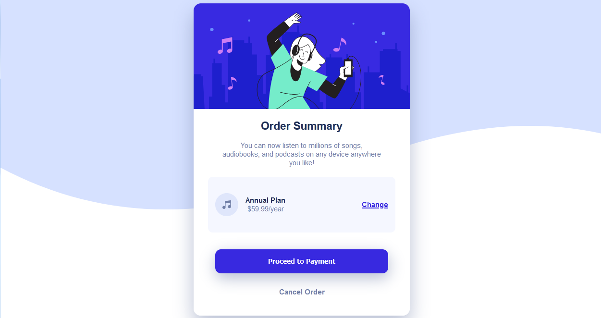

# Frontend Mentor - Order summary card solution

This is a solution to the [Order summary card challenge on Frontend Mentor](https://www.frontendmentor.io/challenges/order-summary-component-QlPmajDUj). Frontend Mentor challenges help you improve your coding skills by building realistic projects. 

## Table of contents

- [Overview](#overview)
  - [The challenge](#the-challenge)
  - [Screenshot](#screenshot)
  - [Links](#links)
- [My process](#my-process)
  - [Built with](#built-with)
  - [What I learned](#what-i-learned)
  - [Continued development](#continued-development)
- [Author](#author)


## Overview

### The challenge

Users should be able to:

- See hover states for interactive elements

### Screenshot



### Links

- Solution URL: [Add solution URL here](https://your-solution-url.com)
- Live Site URL: (http://127.0.0.1:5500/index.html)

## My process

### Built with

- Semantic HTML5 markup
- CSS custom properties
- Flexbox

### What I learned

How to center things

```css
.class {
  margin-left: auto;
  margin-right: auto;
}
```

How to make an image responsive according to a responsive container

```css
.container {
  position: relative;
  padding-top: 56.25%;
}

.img {
    position: absolute;
    left: 0;
    top: 0;
}
```


### Continued development

Responsive design and accesibility


## Author

- Frontend Mentor - [@lvisana](https://www.frontendmentor.io/profile/yourusername)
- Twitter - [@luuphs](https://www.twitter.com/yourusername)

